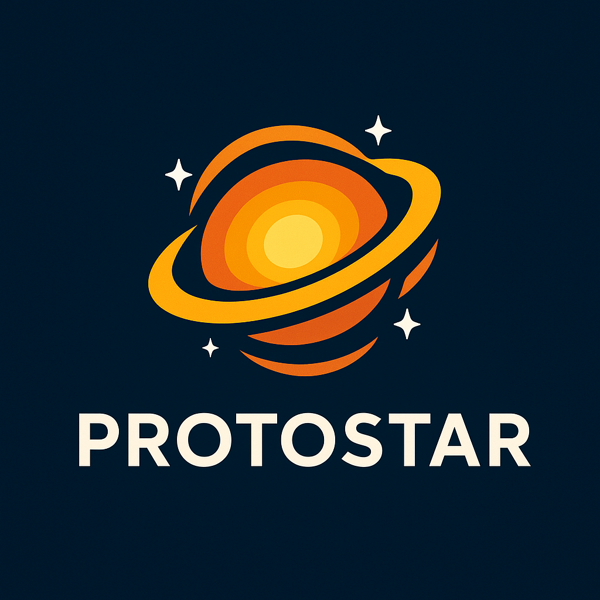

# 🌟 Protostar



[](https://github.com/stellayazilim/Stella.Protostar/releases/tag/v0.1.33)


**Protostar** is your cosmic file generator! 🚀
A GitHub Action and CLI tool built with Go's `text/template`, Protostar makes generating files in your repository **easy, fast, and customizable**. Originally crafted for changelog templates, it’s flexible enough to create **any type of file** in your project.

---

## ✨ Features

* 🌌 **Custom Templates** – Use Go `text/template` syntax to craft your own file formats.
* 🤖 **GitHub Action Integration** – Automate file generation in your workflows.
* 🌠 **Flexible Use Cases** – Changelogs, docs, configs, or any structured text.
* ⚡ **Lightweight & Fast** – Written in Go with minimal dependencies.
* 🪐 **Space-Themed Inspiration** – Because every project deserves a little stardust.

---

## 🚀 Usage

### GitHub Action

```yaml
name: Generate Files
on:
  push:
    branches:
      - main

jobs:
  generate:
    runs-on: ubuntu-latest
    steps:
      - name: Checkout repository
        uses: actions/checkout@v3

      - name: Run Protostar
        uses: your-org/protostar@v1
        with:
          template: templates/changelog.tmpl
          output: CHANGELOG.md
          data: |
            version: "1.0.0"
            date: "2025-08-17"
```

### CLI Usage

```bash
protostar -template templates/changelog.tmpl -output CHANGELOG.md -data data.yaml
```

* `-template` — Path to your Go template
* `-output` — Destination file path
* `-data` — Optional YAML/JSON file for dynamic content

---

## 🌌 Example Template

```gotemplate
# Changelog - Version {{ .version }}

Released on {{ .date }}

## Features
{{ range .features }}
- {{ . }}
{{ end }}

## Bug Fixes
{{ range .fixes }}
- {{ . }}
{{ end }}
```

---

## 👩‍🚀 Contributing

Contribute to make Protostar shine brighter!

1. Fork the repo
2. Create your feature branch (`git checkout -b feature/my-feature`)
3. Commit your changes (`git commit -am 'Add feature'`)
4. Push (`git push origin feature/my-feature`)
5. Open a Pull Request 🌟

---

## 🪐 License

This project is licensed under the MIT License.
See the LICENSE file for details.
